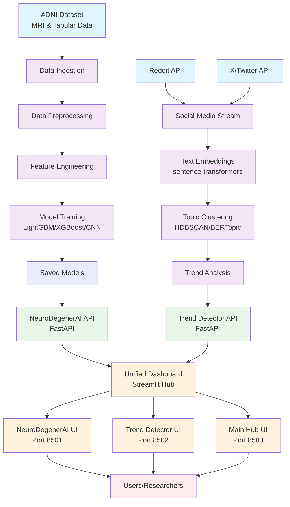

# NeuroDegenerAI Architecture

## System Architecture Overview

## Technology Stack

### NeuroDegenerAI
- **Data**: ADNI (Alzheimer's Disease Neuroimaging Initiative)
- **Models**: LightGBM, XGBoost, ResNet18 CNN
- **Interpretability**: Grad-CAM, SHAP
- **API**: FastAPI with Pydantic schemas
- **UI**: Streamlit with interactive visualizations

### Real-Time Trend Detector
- **Data Sources**: Reddit API, X/Twitter API
- **NLP**: sentence-transformers, BERTopic, HDBSCAN
- **Clustering**: UMAP dimensionality reduction
- **API**: FastAPI with real-time streaming
- **UI**: Streamlit with auto-refresh dashboard

### Infrastructure
- **Containerization**: Docker & Docker Compose
- **CI/CD**: GitHub Actions
- **Deployment**: Google Cloud Run
- **Monitoring**: Structured logging, health checks
- **Development**: Poetry, pre-commit hooks, pytest

## Data Flow

1. **NeuroDegenerAI**: ADNI data → preprocessing → feature engineering → model training → API → UI
2. **Trend Detector**: Social media streams → embeddings → clustering → trend analysis → API → UI
3. **Unified Hub**: Aggregates both services with health monitoring and navigation

## Key Features

- **Production Ready**: Docker containers, CI/CD, monitoring
- **Demo Mode**: Works without API keys or real data
- **Interpretable AI**: Grad-CAM heatmaps, SHAP explanations
- **Real-time**: Live social media trend detection
- **Scalable**: Microservices architecture, cloud deployment ready
